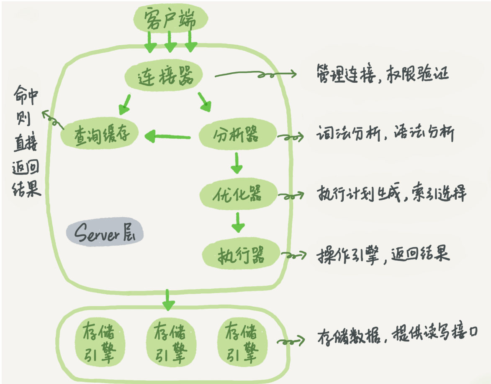
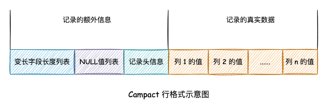

# 数据库引擎

</img>

数据库存储引擎是数据库底层软件组织，负责解释SQL语句，提取出程序所需的数据。不同的引擎采用了不同的存储机制、索引机制。Mysql有InnoDB、MyISAM、Memory三种存储引擎。

|特性| InnoDB | MyISAM |
|-----|-----|-----|
|事务|支持事务，每条SQL都默认封装成事务，自动提交，也可以通过begin commit自行封装事务|不支持事务|
|约束|InnoDB支持外键|不支持外键
|索引|InnoDB必须要有聚簇索引/主键（数据文件与主键索引绑定，普通索引需要主键索引来找到行记录）；不支持全文索引|MyISAM是非聚簇索引，索引与数据文件分离，索引保存了数据文件指针。MyISAM支持全文索引。
|锁|InnoDB支持表锁、行锁|MyISAM只支持表锁|

# InnoDB
## 1、四大特性

## 2、为什么InnoDB推荐使用自增主键
主键是聚簇索引，叶子节点保存主键和数据文件，使用频率高（回表机制）。自增主键能够保证每次插入时，B+树索引都是从右边拓展，相比自定义ID（UUID）可以避免B+树频繁合并分裂。如果使用字符串主键或者随即主键，随机插入操作使得B+树维护复杂。

## 3、存储结构
[参考资料： 详解InnoDB物理存储结构](https://blog.csdn.net/qq_40276626/article/details/109802650)

* 页(Page)
InnoDB将物理磁盘划分为页，每个页大小为16KB，页是最小的存储单位。
* 区(Extent)
页的size太小，不方便管理，因此提出了区。一个区默认由64个连续的页组成(1MB)，是存储空间管理的最小单位（分配/回收）。
* 段(Segment)
B+树索引，分为叶子节点和非叶子节点，叶子节点存放数据页，非叶子节点是索引页，段就是用来存放不同分类的物理页的逻辑组织。每个索引都会创建两个段来分别存放这两部分数据。

### 页结构

</img>

| 字段 | 描述 |
|-----|-----|
| File Header |描述数据页外部信息，比如属于哪个表空间，前后页页号|
| Page Header |描述数据页内部信息，记录数量、第一条记录位置等|
|infimum 和 supremum 纪录|系统生成的记录，infimum 的下一条是用户纪录中键值最小的纪录，supremum 的上一条是用户纪录中键值最大的纪录，通过 next_record 字段来相连。|
|User Records|数据库表中的对应行数据|
|Free Space|页中目前空闲的存储，可以插入记录|
|Page Dictionary|类似于字典的目录结构，根据主键大小，每隔 4-8 个纪录设置一个槽，用来纪录其位置，当根据主键查找数据时，首先一步到位找到数据所在的槽，然后在槽中线性搜素。这种方法比从前到后遍历页的链表的效率更快。|
|Page Tailer|File Header存储刷盘前内存的校验和，Page Tailer储存刷盘后的校验和。当刷盘的时候，出现异常，Page Tailer和File Header中的校验和不一致，则说明出现刷盘错误|

</img>

## 4、Buffer Pool
[参考资料 详解缓冲池](https://juejin.cn/post/6974389300884570149)

这里的Buffer不是Server层的Key-value Buffer（查询缓存），是InnoDB存储引擎层的缓冲池，用于在内存中**以页为单位**缓存磁盘数据，减少磁盘IO，来提高读写速度。

缓冲池大小默认128M，主要存储数据页、索引页、更新缓冲，由**缓存页哈希表 + LRU链表**组成。

### **(1)、预读机制**：
InnoDB引擎接口在被Server层调用时，会在响应时进行预判，将下次可能用到的数据和索引加载到Buffer Pool中。预读策略有线性预读和随机预读（已弃用）两种。

线性预读认为如果前面的请求是按顺序访问当前区的页，那么接下来的请求也会顺序访问下一个区的页，并提前将下一个区加载到Buffer Pool中。默认阈值N为56，最大不超过64（64个页是一个区），表示顺序访问N个页后触发预读机制。

### **(2)、缓冲页管理**
InnoDB使用一个缓存页哈希表来判断数据页是否在缓冲池中，用表空间号+数据页号做key，缓存页地址做value。

Buffer Pool中的页有三种状态：

* 空闲页：通过空闲页链表（Free List）管理。

    Free链表是一个双向链表，每个节点都是一个空闲缓存页。当需要从磁盘加载一个页到Buffer Pool中，就从Free链表中取出一个数据块，然后将页数据、页描述信息写入空闲块，并将其从Free链表中移除。

*  正常页：通过LRU链表（LRU List）管理。

    LRU链表采用的是LRU（最近最少使用）算法来管理数据页。当缓冲池大小达到上限时，保留最频繁访问的数据，很少访问的数据就可以淘汰掉。

    算法考察：双向链表模拟BufferPool，哈希表模拟缓冲页哈希表

    * **传统LRU算法**：当把数据页加载到缓存池中时，把这个缓存页的扫描数据块放到LRU链表的表头（所有刚被加载到缓存池的数据页都这样操作）。后续如果查询或者修改了缓存池中的某个缓存页也将其放到LRU链表表头。当缓存池达到上限时，将表尾的数据页刷回到磁盘，新页添加到表头。

        **问题：**

        (1.预读失效: 由于预读机制，每次要加载一个区的数据页，很有可能将LRU链表中常用到的数据页刷回到磁盘中，而预读出的页大部分都不常使用，这就违背了LRU的初衷。

        (2.缓冲区污染: 当批量扫描大量数据时(全表扫描)，可能会将缓冲页所有页都替换出去，热数据大量被换出，性能会急剧下降。

    * **冷热分离LRU算法**：将LRU链表分为两个部分，热数据(young)部分和冷数据(old)部分,每个部分所占的比例可以通过innodb_old_blocks_pct参数来指定，默认为37，意思是冷数据占比37%（$ \frac38$）。

        数据页第一次被加载到缓存的时候放在冷数据区链表头部，当被加载到old区一段时间（由innodb_old_blocks_time指定）后被访问，就会移动到young区的链表头部。
    
        如果数据页在热数据区域，且被访问，不会立刻移动到young区表头(因为链表的移动也有性能消耗)；young区前25%的缓存页被访问，他们是不会移动的，只有后75%的缓存页被访问才会移动到表头。

    
(3). 脏页(缓冲池中被修改过的页，与磁盘上的数据页不一致)：通过LRU链表和脏页链表（Flush List）管理。

### (3)、Change buffer（写缓冲）
官方定义：它是一种应用在**非唯一普通索引页(non-unique secondary index page)** 不在缓冲池中，对页进行了写操作，并不会立刻将磁盘页加载到缓冲池，而仅仅记录缓冲变更(buffer changes)，等未来数据被读取时，再将数据合并(merge)恢复到缓冲池中的技术。写缓冲的目的是降低写操作的磁盘IO，提升数据库性能。

简单来说就是Buffer pool会缓存数据页和索引页，如果写操作针对的普通索引页不在缓存中，就需要从磁盘获取，就涉及了磁盘IO。 Change Buffer用来将写操作缓存起来，并在redo log记录，等下次读操作把所需数据页从磁盘中读出时，将缓存的写操作与原始数据merge，再刷盘，省去写操作的磁盘IO。也就是**写操作不急着立刻执行，存起来等读操作再一起执行，减少磁盘IO**。
