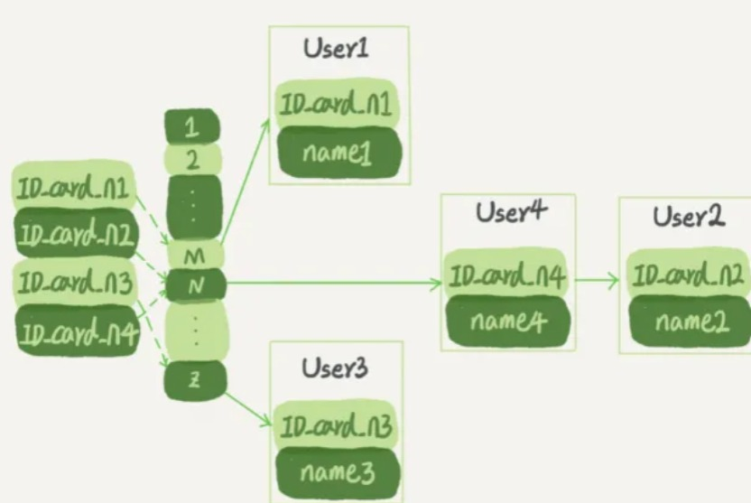

# MySQL语句执行过程


# 数据库索引
索引是**以数据库表中的一列或者多列值为基础构建起的搜索结构**(按照该列值能找到记录)，能够方便用户按照该列值对表内记录进行搜索。

优点：
* 大大加快了数据检索速度(如果不加索引，那么数据库查询就是全表扫描)；
* 唯一性索引能够保证数据库表数据的唯一性；
* 加速表的连接。

缺点:
* 索引需要占用数据库表之外的物理存储空间(索引存储在硬盘中)；
* 创建和维护索引需要花费一定时间；
* 对表进行更新操作时，索引也需要被重建，降低了数据维护速度。

索引需要考虑的查询操作：

* 等值查询
* 范围查询

# 常见的索引类型（从数据结构看）
按照实现方式分类，常见的索引类型主要有哈希、B-树和有序数组。
## 一、有序数组索引

<div align=center ></div>


有序数组就是按字段值进行顺序存储，在等值查询和范围查询的场景下性能都很优秀。可以通过二分算法进行快速查找，时间复杂的O(log(N))。

但是有序数组的维护成本最高，当有新数据插入或删除时需要移动剩余元素，当有元素修改时，也会产生大量的移动。因此有序数组索引只适用于静态存储引擎，所保存的数据是不会被修改的。

*****

## 二、哈希索引
<div align=center ></div>

哈希索引存储键值对。用哈希进行索引，需要先用哈希函数将key映射成哈希数组中的一个index，然后将对应记录，存放到这个位置。如果多个key哈希之后得到了相同的index，可以用开放寻址法或拉链法（常用）来解决冲突。

哈希索引只能用于等值查询，无法用于范围查询。哈希索引的范围查询实际上就是全表扫描。

哈希表适用于只有等值查询的场景，比如一些NoSQL引擎。
****
## 三、B-树索引(B+树索引)
### **1、B-树**：
B树是一种多叉自平衡树，一个$ m $阶的B树满足如下条件    
* 每个节点最多只有$ m $个子节点（因为至多有$m-1$个元素）;
* 除根之外的每个非叶子节点有至少 $ \lceil m/2 \rceil$个子节点，有 $\lceil m/2 \rceil - 1 $ 到 $m - 1$个元素;
* 具有$ k $个子节点的非叶节点包含$ k - 1 $个键(元素数和子节点数之间的关系)。
* 如果根不是叶节点，则根至少有2个子节点;
* 所有叶子节点又在同一层。

|        | 根节点 |非叶子节点 | 叶子节点 |
|  ----  | ----   | ----   | ----   |
| 子节点下限  | $ 2 $ | $ \lceil m/2 \rceil$  |  $ 0 $   |
| 子节点上限  | $ m $  | $ m $  |  $ 0 $   |
| 元素个数下限 | $ 1 $ | $\lceil m/2 \rceil - 1 $  | $\lceil m/2 \rceil - 1 $  | 单元格 |
| 元素个数上限 | $ m-1 $  | $ m - 1 $  | $ m - 1 $  |

#### **B-树插入**：
针对$m$阶高度$h$的B树，插入一个元素时，首先在B树中是否存在，如果不存在，即在叶子结点处结束，然后在叶子结点中插入该新的元素。

* 若该节点元素个数小于$m-1$，直接插入；
* 若该节点元素个数等于$m-1$，引起节点分裂；以该节点中间元素为分界，取中间元素（偶数个数，中间两个随机选取）插入到父节点中；
* 重复上面动作，直到所有节点符合B树的规则；最坏的情况一直分裂到根节点，生成新的根节点，高度增加1

#### **B-树删除**：
首先查找B树中需删除的元素,如果该元素在B树中存在，则将该元素在其结点中进行删除；删除该元素后，首先判断该元素是否有左右孩子结点，如果有，则上移孩子结点中的某相近元素(“左孩子最右边的节点”或“右孩子最左边的节点”)到父节点中，然后是移动之后的情况；如果没有，直接删除。
* 某结点中元素数目小于（m/2）-1,(m/2)向上取整，则需要看其某相邻兄弟结点是否丰满；
* 如果丰满（结点中元素个数大于(m/2)-1），则向父节点借一个元素来满足条件；
* 如果其相邻兄弟都不丰满，即其结点数目等于(m/2)-1，则该结点与其相邻的某一兄弟结点进行“合并”成一个结点；


#### **B树理论高度**：
一颗总共有N个关键字的m阶B树的最大高度：$(log_{\frac{m}2} \frac{N+1} 2 )+1$


#### **B树与磁盘IO**：
索引是存储在硬盘中的，因此 $\color{Red}B-树的查询过程就是一个磁盘IO的过程$ B-树的查询过程就是一个磁盘IO的过程，B-树每一层的查询都有一次磁盘IO。在相同数量的总元素个数下，$\color{Red}每个节点的元素个数越多，高度越低，查询所需的I/O次数越少$。

数据库B-树索引每个节点都是一个数据页(MySQL大小为16K),假设每个元素是n Byte类型数据，那么就可以构建一个 16K/nB阶的B-树。B-树能够通过增大节点元素数量有效减少树的高度来减少磁盘IO次数，从而提高查询效率。

*****

### **2、B+树**：
B+树是应文件系统所需而产生的B-树的变体。具有以下特征:
* 有$k$个子树的中间节点包含有$k$个元素，每个元素不保存关键字指针，只用来索引。（B树中是$k-1$个元素，每个元素既保存索引值，又保存关键字指针）
* 所有的叶子结点中包含了全部关键字的信息，及指向含有这些关键字记录的指针，且叶子结点本身依关键字的大小自小而大的顺序链接。 (而B-树的叶子节点并没有包括全部关键字，根节点、中间节点、叶子节点一起包括了全部的关键字)；
* B+树的叶子节点用链表串接起来，且有序。

#### B+树相比B-树的优势：

* (1).B+树的磁盘读写代价更低： B+树根节点和中间节点不存指针信息，能够读取更多的关键字，IO次数更低。
* (2).B+树查询效率稳定：B+树只有叶子节点才包含关键字指针信息，任何查询都必须查到叶子节点，每次查询的效率相当。
* (3).B+树便于范围查询：B+树范围查找在链表上查找，效率非常高。B树范围查找使用中序遍历（搜索树）

*****

### **3、红黑树**

#### 红黑树和B+树：
红黑树（非严格平衡）插入和删除效率高，但是磁盘IO次数多。如果红黑树在内存中效率会非常高（不用磁盘IO）。B+树严格平衡树，插入删除的效率低，但是树的高度低，所需的磁盘IO次数少。
*****

# MySQL索引类型
## 物理结构：
* 聚簇索引：指索引的键值的逻辑顺序与表中相应行的物理顺序一致，即每张表只能有一个聚簇索引，也就是我们常说的主键索引；
* 非聚簇索引：逻辑顺序则与数据行的物理顺序不一致。
## 应用：
* 普通索引：MySQL 中的基本索引类型，没有什么限制，允许在定义索引的列中插入重复值和空值，纯粹为了提高查询效率。通过 ALTER TABLE table_name ADD INDEX index_name (column) 创建；
* 唯一性索引：索引列中的值必须是唯一的，但是允许为空值。通过 ALTER TABLE table_name ADD UNIQUE index_name (column) 创建；
* 主键索引：特殊的唯一索引，也成聚簇索引，不允许有空值，并由数据库帮我们自动创建；
* 联合索引：组合表中多个字段创建的索引，遵守最左前缀匹配规则；


## 设计原则：
* 为常作为查询条件的字段建立索引；如果某个字段经常用来做查询条件，那么该字段的查询速度会影响整个表的查询速度。因此，为这样的字段建立索引，可以提高整个表的查询速度。
* 为经常需要排序、分组和联合操作的字段建立索引；经常需要 ORDER BY、GROUP BY、DISTINCT 和 UNION 等操作的字段，排序操作会浪费很多时间。如果为其建立索引，可以有效地避免排序操作。
* 限制索引的数目；每个索引都需要占?用磁盘空间，索引越多，需要的磁盘空间就越大，修改表时，对索引的重构和更新很麻烦。
* 小表不建议索引（如数量级在百万以内）；由于数据较小，查询花费的时间可能比遍历索引的时间还要短，索引可能不会产生优化效果。
* 尽量使用数据少的索引；如果索引的值很长，那么查询的速度会受到影响。此时尽量使用前缀索引。
* 删除不再使用或者很少使用的索引。

## EXPLAIN关键字
使用EXPLAIN关键字可以模拟优化器执行SQL查询语句，其用法就是EXPLAIN + SQL 语句
执行计划包括如下信息：
|字段|描述|
|--|--|
|id|select查询的序列号，表示查询中select子句的顺序，id相同执行顺序从上到下，id不同越大优先级越高|
|select_type|区别普通查询、联合查询、子查询等类型|
|table|当前执行的表|
|type|查询类型，常用的有const、ref、range、index、all <br> all: 全表扫描 <br> range:范围查找 <br> |
|possible_keys|可能应用在这张表中的索引，一个或多个|
|key|实际使用的索引，如果为NULL，则没有使用索引或索引失效|
|ref|显示索引那一列被用到了|

## 索引失效：
```SQL
-- 建立id主键索引，name索引，(name,age)联合索引
CREATE TABLE `student` (
  `id` int NOT NULL COMMENT 'id',
  `name` varchar(255) COLLATE utf8mb4_bin DEFAULT NULL COMMENT '姓名',
  `age` int DEFAULT NULL COMMENT '年龄',
  `birthday` datetime DEFAULT NULL COMMENT '生日',
  PRIMARY KEY (`id`),
  KEY `idx_name` (`name`) USING BTREE,
  KEY `idx_name_age` (`name`,`age`) USING BTREE
) ENGINE=InnoDB DEFAULT CHARSET=utf8mb4 COLLATE=utf8mb4_bin;
-- 插入数据
INSERT INTO `student` VALUES (1, '张三', 18, '2021-12-23 17:12:44');
INSERT INTO `student` VALUES (2, '李四', 20, '2021-12-22 17:12:48');
INSERT INTO `student` VALUES (3, '张三', 20, '2021-12-23 17:12:44');
```

```SQL
-- 使用主键索引
EXPLAIN SELECT * FROM `student` where id =1;
-- 使用name索引    
EXPLAIN SELECT * FROM `student` where name = "张三";
-- 使用联合索引  
EXPLAIN SELECT * FROM `student` where name = "张三" and age = 20;
-- 联合索引 where顺序优化 仍按照 name age
EXPLAIN SELECT * FROM `student` where age = 20 and name = "张三";


```
|id|select_type|table|partitions|type|possible_keys|key|key_len|ref|rows|filtered|Extra|
|--|--|--|--|--|--|--|--|--|--|--|--|
|1|SIMPLE|student|NULL|const|**PRIMARY**|**PRIMARY**|4|const|1|100.00|NULL|
|1|SIMPLE|student|NULL|ref|**idx_name**,**idx_name_age**|**idx_name**|1023|const|2|100.00|NULL|
|1|SIMPLE|student|NULL|ref|**idx_name**,**idx_name_age**|**idx_name_age**|1028|const,const|1|100.00|NULL|

### 1. 查询条件中有OR

```SQL
-- 查询条件带OR -索引失效
EXPLAIN SELECT * FROM `student` where id =1 or age = 20;
```
|id|select_type|table|partitions|type|possible_keys|key|key_len|ref|rows|filtered|Extra|
|--|--|--|--|--|--|--|--|--|--|--|--|
|1|SIMPLE|student|NULL|const|**PRIMARY**|**PRIMARY**|4|const|1|100.00|NULL|
### 2. like查询以%开头(模糊查)
```SQL
-- 模糊查找以%开头 索引失效
EXPLAIN SELECT * FROM `student` where name like'%伟';
-- 模糊查找以#开头 索引生效
EXPLAIN SELECT * FROM `student` where name like'#伟';
```
|id|select_type|table|partitions|type|possible_keys|key|key_len|ref|rows|filtered|Extra|
|--|--|--|--|--|--|--|--|--|--|--|--|
|1|SIMPLE|student|NULL|ALL|NULL|**NULL**|NULL|NULL|3|100.00|Using where|
|1|SIMPLE|student|NULL|range|**idx_name**,**idx_name_age**|**idx_name**|1023|NULL|1|100.00|Using index condition|
### 3. where索引列发生类型转化
```SQL
-- 字符串数据无引号(类型被转化) - 索引失效
EXPLAIN SELECT * FROM `student` where name = 222;
```
|id|select_type|table|partitions|type|possible_keys|key|key_len|ref|rows|filtered|Extra|
|--|--|--|--|--|--|--|--|--|--|--|--|
|1|SIMPLE|student|NULL|ALL|**idx_name**,**idx_name_age**|**NULL**|NULL|NULL|3|33.3|Using where|
### 4. 索引列上发生计算
```SQL
-- 索引列发生计算或表达式 - 索引失效
EXPLAIN SELECT * FROM `student` where id-1 = 1;
```
|id|select_type|table|partitions|type|possible_keys|key|key_len|ref|rows|filtered|Extra|
|--|--|--|--|--|--|--|--|--|--|--|--|
|1|SIMPLE|student|NULL|ALL|**NULL**|**NULL**|NULL|NULL|3|100.00|Using where|


### 5. 联合索引失效 - 违背最左匹配原则
```SQL
-- 再建立一个联合索引
ALTER TABLE `student` ADD KEY `idx_name_age_birthday` (`name`,`age`,`birthday`) USING BTREE;
-- 违背最左匹配原则  - 联合索引失效，只会用但name的单索引
explain SELECT * FROM `student` where age = 20 and birthday = now();
-- 联合索引中出现范围 - 联合索引生效
explain SELECT * FROM `student` where name = "张伟" and age = 20 and birthday < now();
-- 联合索引部分缺失(但不违背最左匹配) - 联合索引生效
explain SELECT * FROM `student` where name = "张伟" and birthday = now();
```
**联合索引最左匹配原则：**

最左优先，以最左边为起点任何连续的等值索引都能匹配上。同时遇到范围查询（>、<、between、like）就会停止匹配。

如建立 (a,b,c,d) 索引，
* 查询条件 b = 2是匹配不到索引的（违背最左匹配）
* 查询条件 b = 2 and a = 1，Innodb自动调整顺序，能够匹配到索引a 和 b
* 查询条件 a = 1 and c = 1，虽然没有b，但能够匹配到a 和 c
* 查询条件 a = 1 and b > 2 and c = 1， b范围查找，只能匹配索引a 和 b

原理：mysql联合索引排序类似于Order by，因此特别强调最左优先和等值查询，只有当左侧为等值查询时，即左侧有序，右侧查询才能保证有序，如果左侧不是等值查询，是范围查询，无法保证右侧查询的有序性（左侧不同，根本无法比较）。


## 回表查询：
InnoDB聚簇索引：叶子节点存储行记录（就是数据文件）；如果定义了主键，主键就是聚簇索引，如果没有定义主键，逐渐第一个not null的unique列是聚簇索引，否则InnoDB创建一个隐藏的_row_id作为聚簇索引。
InnoDB普通索引：叶子节点存储主键值。

因此InnoDB主键查询非常快，普通索引查询需要扫描两遍索引树。先通过普通索引定位主键，再通过主键定位行记录（回表）。

## 索引覆盖（联合索引减少回表操作）：
如果一个索引包含（或者说覆盖）所有需要查询的字段的值，我们就称之为“覆盖索引”。索引覆盖就不需要回表查询了。

如何实现索引覆盖：将被查询的字段建立到联合索引里。

## 索引下推(icp)：
解决联合索引中未使用的Where条件导致的回表扫描问题。

* 没有索引下推：
    
    (1).存储引擎读取索引记录；
    
    (2).根据索引中的主键值，定位并读取完整的行记录(回表)；
    
    (3).存储引擎把记录交给Server层去检测该记录是否满足WHERE条件。

* 有索引下推：
    
    (1).存储引擎读取索引记录（不是完整的行记录）；
    
    (2).判断WHERE条件部分能否用索引中的列来做检查，条件不满足，则处理下一行索引记录；条件满足，使用索引中的主键去定位并读取完整的行记录（回表）；
    
    (3).存储引擎把记录交给Server层，Server层检测该记录是否满足WHERE条件的其余部分。

例子： 
表 User， 字段 id,name,age,phone,address， 联合索引(name age)
`select * from tuser where name like '张%' and age=10;`
由最左前缀匹配，where中只有name字段会用于索引查询，age字段浪费了。

没有索引下推的情况：通过联合索引找到所有name like '张%'的主键id，然后逐一回表查询得到所有name like'张%'的完整行记录，由server层根据 age = 10条件进行筛选

有索引下推：通过联合索引找到所有name like '张%'的主键id，此时联合索引有关键字age,由引擎在此直接过滤，将过滤后的数据回表扫描。


**利用Where里的联合索引在回表之前进行一个条件检查，有效的减少了回表记录数量。**
## EXPLAIN 查明索引