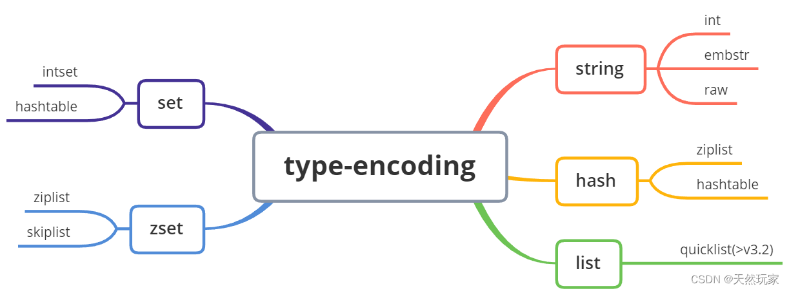
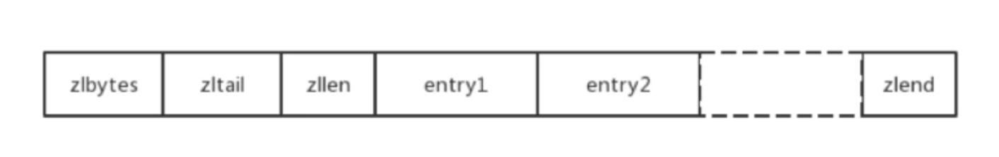
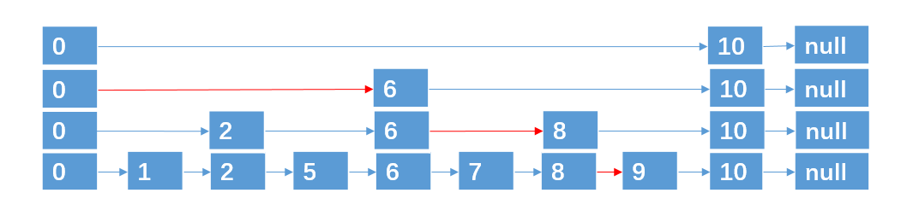

# Redis
## Redis特性
Redis(Remote Dictionary Server)是使用C语言编写，基于内存又可持久化的Key-Value数据库。Redis的读写速度非常快，每秒可以处理超过10万次读写操作。因此redis被广泛应用于缓存，另外，Redis也经常用来做分布式锁。除此之外，Redis支持事务、持久化、LUA 脚本、LRU 驱动事件、多种集群方案。
## Redis单线程
为什么redis使用单进程、单线程也能很快：

1、基于内存的操作；redis实现了有效的内存维护和管理，除了键值对的增删改查外，还有以下维护性操作：

    (1).命中率统计：在读取一个键之后，服务器会根据键是否存在来更新服务器的键空间命中次数或键空间不命中次数；

    (2).LRU时间更新：在读取一个键之后，服务器会更新键的LRU时间，这个值可以用于计算键的闲置时间；对应redisObject中的lru。

    (3).键的dirty标识：如果有客户端使用WATCH命令监视了该键，服务器会将这个键标记为dirty，让事务程序注意到这个键已经被修改过。每次修改都会对dirty加一，用于触发持久化和复制。

    (4).数据库通知：如果服务器开启了数据库通知功能，那么在对键进行修改之后，服务器将按配置发送相应的数据库通知。

    (5).redis数据过期删除策略：
        (1、定期删除策略：Redis启用一个定时器定时监视所有key，判断key是否过期，过期的话就删除。这种策略可以保证过期的key最终都会被删除，但是也存在严重的缺点：每次都遍历内存中所有的数据，非常消耗CPU资源，并且当key已过期，但是定时器还处于未唤起状态，这段时间内key任然可以使用。（时间换空间）
        (2、惰性删除策略：在获取 key 时，先判断 key 是否过期，如果过期则删除。这种方式存在一个缺点：如果这个 key 一直未被使用，那么它一直在内存中，其实它已经过期了，会浪费大量的空间。（空间换时间）
        (3、定期删除+惰性删除策略是如何工作的？
        这两种策略天然的互补，结合起来之后，定时删除策略就发生了一些改变，不在是每次扫描全部的 key 了，而是随机抽取一部分 key 进行检查，这样就降低了对 CPU 资源的损耗，惰性删除策略互补了为检查到的key，基本上满足了所有要求。
        但是有时候就是那么的巧，既没有被定时器抽取到，又没有被使用触发惰性删除，是否会把内存撑爆？回答是不会，当内存不够用时，内存淘汰机制就会上场。
        (4、Redis 内存淘汰机制有以下几种策略：
            noeviction：当内存不足以容纳新写入数据时，新写入操作会报错。(Redis 默认策略)
            allkeys-lru：当内存不足以容纳新写入数据时，在键空间中，移除最近最少使用的 Key。(推荐使用)
            allkeys-random：当内存不足以容纳新写入数据时，在键空间中，随机移除某个 Key。
            volatile-lru：当内存不足以容纳新写入数据时，在设置了过期时间的键空间中，移除最近最少使用的 Key。这种情况一般是把 Redis 既当缓存，又做持久化存储的时候才用。
            volatile-random：当内存不足以容纳新写入数据时，在设置了过期时间的键空间中，随机移除某个 Key。
            volatile-ttl：当内存不足以容纳新写入数据时，在设置了过期时间的键空间中，有更早过期时间的 Key 优先移除。


2、使用了 I/O 多路复用模型，select、epoll 等，基于 reactor 模式开发了自己的网络事件处理器；

3、单线程可以避免不必要的上下文切换和竞争条件，减少了这方面的性能消耗。

4、数据结构优化，例如：对数据结构进行了优化，简单动态字符串、压缩列表等。


## Redis基本数据类型与底层数据结构
Redis基本数据类型有:String、List、Hash、Set、SortedSet(Zset)，还有三种特殊的数据结构类型:Geospatial、Hyperloglog、Bitmap。Redis数据主要分为五个部分组成，分别为当前数据显式类型（type）、实际编码（encoding）、访问时间（lru，秒）、引用计数（refcount）和实际数据指针（ptr），底层实现如下所示：

```
// Redis底层数据结构
typedef struct redisObject {
    unsigned type:4; // 4位=0.5字节
    unsigned encoding:4; // 4位=0.5字节
    unsigned lru:LRU_BITS; // 24位=3字节
    int refcount; // 32位=4字节
    void *ptr; // 64位=8字节
} robj;
```

显式类型就是上面提到的五种基本数据类型，编码方式是数据最终的存储类型，也是ptr所指向的实际数据类型，也就是隐式类型。每种显式类型会根据不同的阈值在不同的隐式类型中切换。
|  序号   | type  |  描述   |
|  ----  | ----  |  ----  |
| 1  | String | 字符串  |
| 2  | List | 列表  |
| 3  | Hash | 哈希  |
| 4  | Set  | 字典  |
| 5  | ZSet | 有序字典  |

|  序号   | encoding  |  描述   |
|  ----  | ----  |  ----  |
| 1  | int | 整数  |
| 2  | raw | embstr编码SDS  |
| 3  | embstr | SDS  |
| 4  | hashtable  | 哈希表  |
| 5  | linkedlist | 双向链表  |
| 6  | ziplist | 压缩列表  |
| 7  | intset | 整数集合  |
| 8  | skiplist | 跳表和字典  |

下图是显示类型所对应的实际编码方式：
<div align = center></img> </div>

|  序号   | type  |  encoding   |
|  ----  | ----  |  ----  |
| 1  | String | （1）int:值为整型，取值[-2^64,2^64-1]<br> （2）embstr: 值不为整型或整型值不在上述范围，长度小于等于44个字节 <br> （3）raw:值不为整型或整型值不在上述范围，且长度超过44(64-16-3-1)字节 <br> 注意:不同的redis版本,embstr与raw的边界值不同|
| 2  | List | （1）ziplist/linkedlist <br> （2）quicklist  |
| 3  | Hash | （1）ziplist <br> （2）hashtable |
| 4  | Set  | （1）intset <br> （2）hashtable  |
| 5  | ZSet | （1）ziplist <br> （2）skiplist |

### **1. String - SDS**
```
// SDS结构体
struct sdshdr {
    // 记录 buf 数组中已使用字节的数量
    // 等于 SDS 所保存字符串的长度
    int len;

    // 记录 buf 数组中未使用字节的数量
    int free;

    // 字节数组，用于保存字符串
    char buf[];
};
```
相对于C语言字符串的优势：
1. SDS获取字符串长度复杂度为O(1)；
2. 具有free字段和自动扩容，能杜绝缓冲区溢出；
3. 空间预分配和惰性空间释放机制，能减少修改字符串带来的内存重分配次数。C语言中字符串不记录自身长度，因此N个字符的C字符串总是一个N+1长的数组。每当修改字符串时都要进行内存重分配。内存重分配是一个非常耗时的操作。SDS保留了字符串长度，buf里可以有未使用的字节。
    
    (1). 空间预分配用于**字符串增长**操作；当SDS需要空间拓展时，程序为SDS分配额外的空间。
        
        如果修改后buff已使用长度 len < 1MB，分配len长度的未使用空间即 len = free，总长度为2 * len；
        如果修改后buff已使用长度 len >= 1MB，那么会分配1MB的未使用空间 free = 1MB，总长度 len + 1MB。
    (2). 惰性空间释放用于**字符串缩短**操作；当需要缩短SDS保存的字符串时，程序并不立即使用内存重分配来回收缩短后多出来的字节，而是使用 free 属性将这些字节的数量记录起来，并等待将来使用。

4. 二进制安全（不需要'\0'这一转义字符），可以存储所有类型的二进制文件。但是SDS也会兼容C字符，总会在SDS保存的数据末尾设置空字符（多分配一个字节来容纳这个字符）

### **2. List - ziplist/quicklist**
Redis3.2之前使用ziplist和双向linkedlist作为list底层实现。当列表元素较少时，使用ziplist，当列表元素多时使用linkedlist。

为什么使用ziplist：

(1) 普通双向链表有两个指针，占用内存空间大；

(2) 链表不连续，查询效率低（读多写少），而且当节点较多时，会产生大量的内存碎片。

zipList本质上是一个字节数组，是一种线性数据结构，可以包含多个任意多个元素。字节数组划分为多个字段，如下图所示：
<div align = center></img> </div>

ziplist中的数据以不规则的方式紧邻


Redis3.2之后开始使用quicklist作为List对象的底层存储形式。quickList是zipList和双向linkedList的混合体。将linkedList按段切分，每段使用zipList紧凑存储，多个zipList之间使用指针串接。
<div align = center></img> </div>

### **3. Hash - 压缩列表/拉链法哈希表**

Redis hash用哈希表实现，采取拉链法解决哈希碰撞。实际实现就是定长数组+链表。底层实现是dict结构，每个dict中有两个dictht(hashtable)结构，用于rehash，同时保证性能。
```
typedef struct dict {
	//哈希表
	dictht ht[2];
	//rehashidx 记录了rehash 的进度。
	//当没有进行 rehash 时为 -1。
	int rehashidx; 
	// 其他数据成员
	....
};

// hashtable底层实现
typedef struct dictht {
    // hash表结点数组
    // 每个 table[i] 其实是一个链表的头节点
    dictEntry **table;
    // hash表结点数组的大小，总是为 2^n
    unsigned long size;
    // 用于计算索引值的掩码，总是等于 size-1
    unsigned long sizemask;
    // 该hash表中的结点数量
    unsigned long used;
} dictht;
```

Rehash：随着增删操作进行，hashtable中的负载因子数量发生变化。(1) 当负载因子较大时，链表平均长度过长，查询效率低；(2)当负载因子较小时，数组无法完全利用，浪费内存。因此需要将负载因子维持在一个合理范围内。
* 负载因子计算:
    $$loadfactor = ht[0].used/ht[0].size$$
* rehash条件:
    
    扩容:服务器目前没有在执行 BGSAVE 命令或者 BGREWRITEAOF 命令，并且哈希表的负载因子大于等于 1；服务器目前正在执行 BGSAVE 命令或者 BGREWRITEAOF 命令，并且哈希表的负载因子大于等于 5。
    
    缩容：负载因子小于0.1时。

* rehash过程：用两个哈希表存储数据，一开始使用默认哈希表dictht[0]存储数据，随着dictht[0]中数据越来越多，Redis给dictht[1]分配内存，然后将dictht[0]中元素重新映射到dictht[1]中，最后释放dictht[0]。

* 渐进式rehash：如果简单粗暴的一次rehash完所有数据，当dictht[0]中数据非常多时，会阻塞Redis主线程，影响到性能。Redis进行的是**按链表分批次的拷贝**，每次对哈希表增删改的同时将dictht[0]在rehashidx索引上的键值对链表rehash到dictht[1]。当所有的键值对都拷贝完成后就释放dictht[0]，并将dictht[1]设置为dictht[0]。

### **4. Set - intset/字典**

### **5. ZSet - 跳表**
Redis使用压缩列表和跳表作为有序集合底层实现。当有序集合元素数量较多时，会使用跳表。

跳表是一种有序数据结构，通过在每个节点中维持多个指向其他节点的指针(注：可以理解为维护了多条路径)，从而达到快速访问节点的目的。
<div align = center></img> </div>

    (1)跳跃表的每一层都是一条有序的链表。
    (2)维护了多条节点路径。
    (3)最底层的链表包含所有元素。
    (4)跳跃表的空间复杂度为 O(n)。
    (5)跳跃表支持平均O(logN)、最坏O(N)复杂度的节点查找（二分查找），还可以通过顺序性操作来批量处理节点。在大部分情况下跳表性能都与平衡树（红黑树）相当。

Redis跳跃表由zskiplist和zskiplistNode结构实现。
```
typedef struct zskiplist{
    // 表头节点和表尾节点
    structz skiplistNode *header,*tail;
    // 表中节点的数量
    unsigned long length;
    // 表中层数最大的节点层数
    int level;
}zskiplist;

typedef struct zskiplistNode{
    // 层数据结构(数组)
    struct zskiplistLevel{
        // 前进指针
        struct zskiplistNode *forward;
        // 跨度（层节点间距离）
        unsigned int span;
    } level [];
    // 后退指针
    struct zskiplistNode *backward;
    //分值
    double score;
    // 成员对象
    robj *obj;
}
```
    (1)zskiplist结构存储并管理额外信息，方便程序的使用。
    (2)zskiplistNode的level数组可以包含多个元素，程序可以通过这些层结构的前进指针来跨度访问，加快访问速度，同时也可以根据span进行位置计算。
       zskiplistNode插入时，level数组的长度是按概率随机获得的。按照概率p(一般是0.5)不断向上插入层。
       zskiplistNode只有一个后退指针，因此只能一位一位的后退访问。
       zskiplistNode分值是浮点数，是跳表排序的value，obj指针指向SDS值，保存真值。

## Redis常用命令


