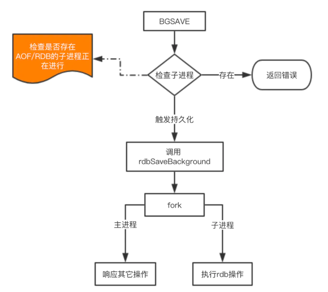
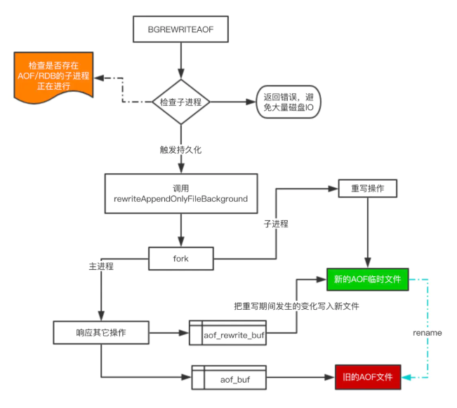
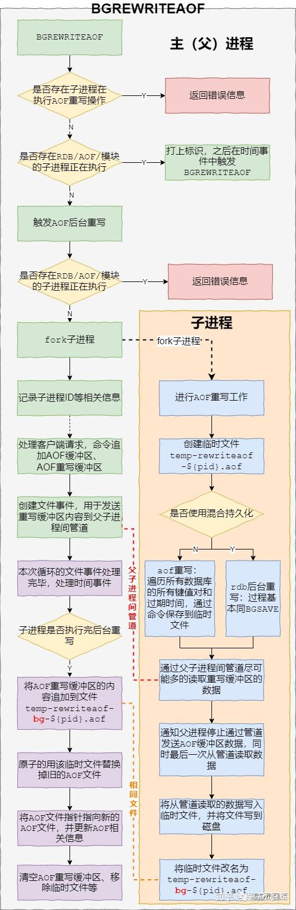

# Redis持久化
Redis运行时保存在内存中，一旦断电数据就全部丢失，因此需要提供持久化手段。
## 1、RDB(Redis Database)持久化：
Redis默认的存储方式，生成**某个时间点的快照文件**。RDB文件是经过压缩的二进制文件。

</img> 

    RDB触发命令：SAVE和BGSAVE。 SAVE生成RDB快照文件，但是会阻塞主进程，服务器无法处理客户端发来的命令请求，所以通常不会使用这个命令。BGSAVE，主进程fork子进程，子进程进行持久化操作，只有在fork过程中会阻塞主进程，之后主进程可以正常处理请求。

        RDB优点： 
        (1). RDB文件紧凑，占空间小（二进制压缩文件），且保存的是某个时间点的数据，适合做备份和传输；
        (2). RDB能够最大化Redis性能（fork子进程）；
        (3). RDB文件恢复比AOF快。
        RDB缺点：
        (1).服务器故障时容易造成数据丢失。RDB保存时间点的数据，如果服务器宕机，超过备份时间间隔，就会导致数据丢失。
        (2). RDB fork也会阻塞主进程，如果数据量大，阻塞时间长（ms级）。
        (3). fork的子进程也会占用内存。子进程采取copy on write的方式。在redis执行RDB期间，如果client写入非常频繁，会增加内存消耗。

## 2、AOF(Append Only File)持久化：
日志追加模式，服务器在执行完一个写命令后，将会把被执行的写命令追加到服务器的AOF缓冲区(aof_buf)末尾，然后再写入到磁盘中（落盘）。Redis还使用了页缓存(page cache)，先将aof_buf内容写入到page cache中，然后执行同步操作来强制刷盘。

</img> 

    触发方式:BGREWRITEAOF命令触发。

        AOF优点： 
        (1). AOF有更强的数据安全性。Redis中提供了三种同步策略来实现强制刷盘：每秒(everysec),每条(always)同步和不同步(no)。三种都是将aof_buf的所有内容写入到缓存，区别在于刷盘频率。默认是everysec，redis就算宕机，也只会丢失一秒钟的数据。
        (2). AOF对日志文件是追加模式，写入过程中出现宕机也不会破坏日志文件中已保存的内容。如果写入一半数据就宕机，可以通过redis-check-aod工具解决数据一致性问题。
        (3). AOF文件会随内容增加变大，过大的AOF文件可能会对redis服务器造成影响（还原数据的时间增加）。AOF有自动重写机制来解决AOF文件过大的问题。重写后的新文件包含了恢复当前数据所需的最小命令集合（合并针对一条数据的写操作）。重写过程是安全的，重写在一个新文件上进行，同时redis仍然在往旧文件里追加数据。
        (4). AOF文件易读，有序的保存了对数据库执行的所有写操作。当意外操作导致数据库数据消失时，可以很容易的恢复数据。
        AOF缺点：
        (1).相同数据集，AOF文件一般比RDB大。
        (2).由于同步刷盘策略，AOF性能可能比RDB差。

## 3、混合持久化：

混合持久化只发生在AOF重写阶段。混合持久化的AOF重写，文件前半段是RDB格式的全量数据，后半段是AOF格式的增量数据。整体格式为 $ [RDB file][AOF tail]$。 当开启混合持久化后，fork出的子进程先将当前全量数据以RDB方式写入到新的AOF文件，然后再将AOF重写缓冲区的增量命令以AOF方式写入到文件，写入完成后通知主进程用含有RDB+AOF格式的文件替换旧的AOF文件。

## 4、AOF重写：
Redis生成新的AOF文件来代替旧AOF文件，这个新的AOF文件**包含重建当前数据集所需的最少命令**。具体过程是遍历所有数据库的所有键，从数据库读取键现在的值，然后用一条命令去记录键值对，代替之前记录这个键值对的多条命令。

</img> 

    AOF重写触发命令：BGREWRITEAOF和REWRITEAOF。关系与SAVE和BGSAVE类似。

    BGREWRITEAOF：使用子进程重写，解决了主进程阻塞问题，但是子进程重写期间，主进程仍在处理新的请求，新的命令会对现有数据库进行修改，从而导致当前数据库状态和重写后的AOF状态不一致。

    如何解决：管道+AOF重写缓冲区(aof_rewrite_buf_blocks)。

    缓冲区：从AOF重写开始，服务器所执行的所有写命令就会被记录到AOF重写缓冲区中，当子进程完成AOF重写工作后，父进程会在ServerCron中检测子进程重写完毕，就会将AOF重写缓冲区所有内容写入到新的AOF文件中（阻塞），并对AOF进行改名，替代旧文件。

    管道：如果AOF重写缓冲区内容过多，主进程将缓冲区内容追加到新AOF文件的时间会很长，将会阻塞主进程。因此Redis使用管道通信和文件时间，将AOF重写缓冲区内容通过管道发到子进程，由此来减少AOF重写缓冲区内容，减少阻塞时间。

